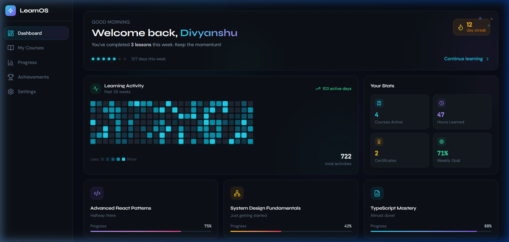
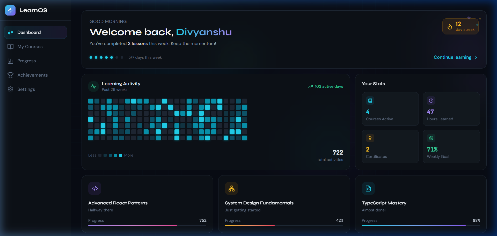
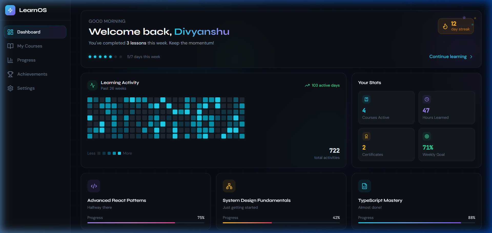

# LearnOS — Next-Gen Student Dashboard

A futuristic, highly responsive student learning portal engineered with the Next.js App Router, live Supabase PostgreSQL integration, Tailwind CSS, and Framer Motion. 

**Live Link:** [https://learning-dashboard-taupe.vercel.app/](https://learning-dashboard-taupe.vercel.app/)

---

## 🌟 Visual Showcase

### 1. Interactive Home Dashboard
Features a dynamic time-based welcoming banner greeting, a contribution calendar activity matrix, custom learning statistics, and live courses fetched from the database.


### 2. Live Courses & Curriculum Hub
Manage dynamic registered curriculum, monitor individual syllabus progress ratios, and launch the custom glassmorphic syllabus modal overlay.


### 3. Topic Analytics & Performance Progress
Visualizes learning performance metrics using spring-physics active study hour charts, weekly goal stats, recent milestone logs, and core topic mastery progress.


### 4. Achievements & Verified Graduate Credentials
Displays verified glowing achievement badges alongside responsive PDF-style verified graduate course certificates.


---

## Tech Stack

* **Frontend Framework:** Next.js 14 (App Router with React Server Components)
* **Styling & Layout:** Tailwind CSS
* **Database & BaaS:** Supabase (PostgreSQL client)
* **Animation Engine:** Framer Motion (Physics-based springs)
* **Icons:** Lucide React
* **Language:** TypeScript

---

## Getting Started

### 1. Installation
Clone this repository locally and install the project dependencies:
```bash
git clone https://github.com/your-username/learning-dashboard.git
cd learning-dashboard
npm install
```

### 2. Database Integration
1. Create a free project at [supabase.com](https://supabase.com).
2. Open the **SQL Editor** in your Supabase dashboard and run the database schema defined in `supabase-setup.sql` to initialize the courses table.
3. Copy your base API URL and anon public key from **Settings → API**.

### 3. Environment Setup
Create a `.env.local` file in your root folder:
```bash
cp .env.example .env.local
```

Populate the environment file with your live Supabase credentials:
```env
NEXT_PUBLIC_SUPABASE_URL=https://your-project-ref.supabase.co
NEXT_PUBLIC_SUPABASE_ANON_KEY=your-anon-public-key
```

*Note: If these credentials are empty or omitted, the application will automatically fall back to serving high-fidelity local static mock data to guarantee compilation stability.*

### 4. Run Locally
Start the development server:
```bash
npm run dev
```
Open [http://localhost:3000](http://localhost:3000) in your web browser.

---

## Architecture & Practical Engineering Decisions

### Component Distribution Model
To take full advantage of Next.js Server Components (RSC) while maintaining fluid interface feedback, the routing pages split data-fetching from user interaction:

```
app/dashboard/page.tsx            ← Server Component (database query)
  └─ DashboardLayout              ← Client Component (responsive responsive layout shell)
       ├─ Sidebar                 ← Client Component (drawer navigation & local persistence)
       └─ BentoGrid               ← Client Component (layout organization)
            ├─ HeroTile           ← Client Component (greeting time logic & course links)
            ├─ ActivityTile       ← Client Component (contribution matrix map)
            ├─ StatsTile          ← Client Component (performance micro-indicators)
            └─ CourseTile         ← Client Component (dynamic progress indicator cards)
```

**Why this layout?**
* **Securing Database Operations:** Data queries are executed directly inside Server Components at the router level. This keeps database clients, API connections, and query operations on the server—preventing key exposures and reducing overall client-side package footprints.
* **Fluid Client Boundaries:** Interactive components like Framer Motion tiles are decoupled into clean leaves (`"use client"`), allowing smooth interface animations to initialize immediately while retaining server-side SEO pre-rendering.

---

## Core Technical Solutions & Fixes

### 1. Cross-Component Reactive Profile Sync
* **The Challenge:** Next.js static pages compile independently. Under standard setups, editing your name in `/settings` will not dynamically propagate changes to the Sidebar or Dashboard greeting without introducing massive, heavy state management libraries like Redux or Zustand.
* **The Solution:** Implemented a lightweight, native reactive listener setup. Saving your profile name in `/settings` persists the entry inside `localStorage` and triggers a custom browser event `studentNameUpdated`. The `Sidebar` and `HeroTile` components listen for this event and dynamically update their greeting states in real-time without requiring a page reload.

### 2. Seamless Responsive Drawer Navigation
* **The Challenge:** Transitioning layouts from desktop widescreen views down to phone-sized viewports typically breaks fixed sidebar structures.
* **The Solution:** Migrated the mobile responsive breakpoint to a standard `lg` (1024px) baseline. We decoupled visibility from `Sidebar.tsx` and moved mobile/tablet wrapper management entirely to `DashboardLayout.tsx` using Tailwind. 
  * In desktop resolutions, the sidebar renders inline.
  * In mobile and tablet resolutions, the interface hides static bars and exposes an animated overlay slide-out drawer containing the premium sidebar view on click of the top-left hamburger menu.
  * Clicking the circular profile avatar `D` in the mobile topbar or the bottom profile card in desktop navigates directly to `/settings` using responsive link wrappers.

### 3. Resolving React Hydration Warnings
* **The Challenge:** Client-side generation of random numbers (for activity heatmaps) or checking client system time (for greeting messages like "Good Afternoon") during Server Side Rendering creates HTML discrepancies between the server pre-render and the client-side paint, causing console hydration warnings.
* **The Solution:** Initialized dynamic properties (like date values and contribution lists) to safe empty static defaults, then updated states within client-side `useEffect` triggers on component mount. This eliminated hydration discrepancies while preserving dynamic calculations.

---

## Production Deployment

### Local Optimization
Verify that the project builds and runs cleanly under next production guidelines:
```bash
npm run build
```

### Vercel Deployment
To deploy to a live Vercel environment:
```bash
npx vercel --prod
```
Ensure you define your production environment variables (`NEXT_PUBLIC_SUPABASE_URL` and `NEXT_PUBLIC_SUPABASE_ANON_KEY`) in your Vercel Dashboard under **Settings → Environment Variables**.
